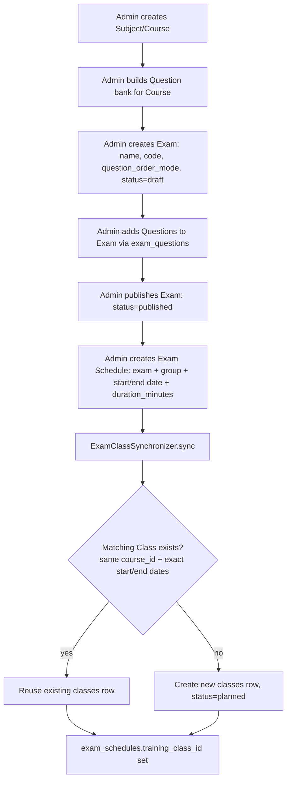
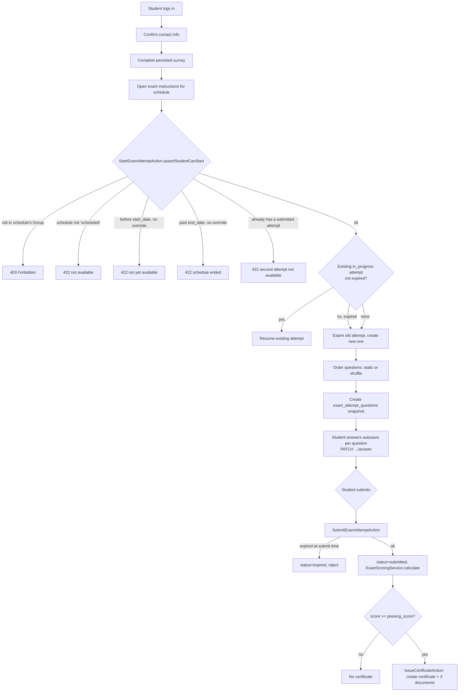
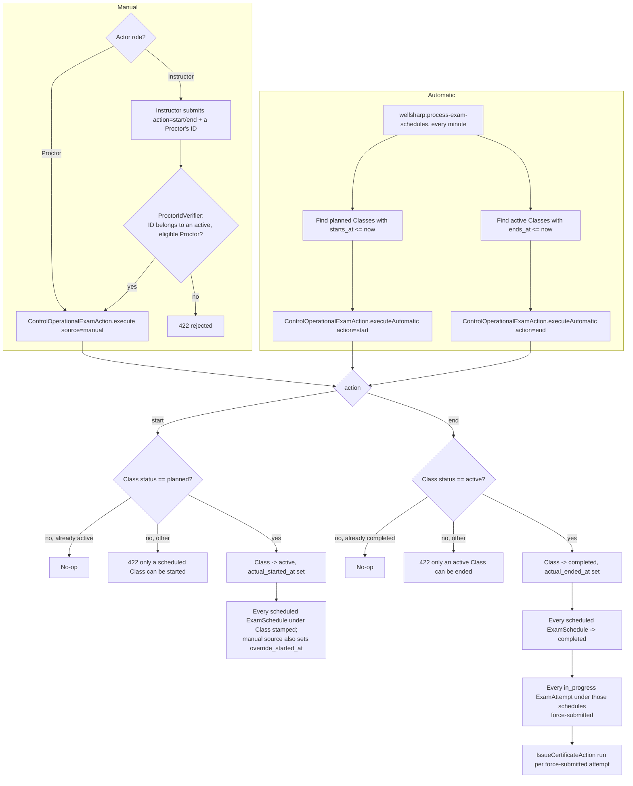

# Business Flows — WellSharp

## 1. Exam authoring → scheduling → Class sync

## 2. Student assessment attempt lifecycle

## 3. Class start / end — manual (Proctor/Instructor) and automatic (scheduler)

## Notes

- The Manual and Automatic branches converge on the **same** `ControlOperationalExamAction::execute()` — there is exactly one implementation of Class start/end business logic, differentiated only by `source` and whether an `actor` is attributed.
- Ending a Class is the single highest-blast-radius operation in the system: it can force-submit multiple students' in-progress attempts and issue certificates as a side effect, in one DB transaction (`DB::transaction` wraps the whole thing — all-or-nothing, no partial-completion risk).
