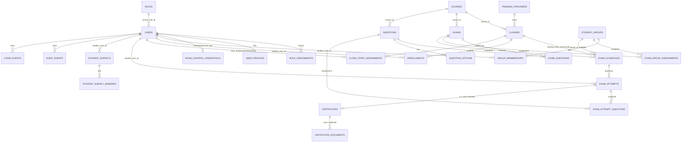

# Database Map — WellSharp

37 migrations, MySQL 8+ target / SQLite for tests. Every business table has: `id` (bigint PK), most also have a `public_id` ULID (unique, used in routes), `created_at`/`updated_at` as `timestampTz`. Status columns are plain `string(24)`, not native DB enums — validity is enforced by PHP backed enums (`app/Enums/*`) at the application layer only.

## Core ER Diagram

## Table Reference

### `roles`
PK `id`; `key` (unique: admin/proctor/instructor/student), `name`, `description`.

### `users`
PK `id`, `public_id` (ULID), `wellsharp_id` (unique login ID), `email` (nullable unique), `password` (hashed — the only value ever checked at login), `password_ciphertext` (nullable text, added `2026_08_16_000002_add_password_ciphertext_to_users_table.php` — `Crypt`-encrypted plaintext, populated only for Student-role accounts so Admin/Proctor/Instructor can look it up; see BUSINESS_RULES.md BR-037..BR-042), `status` (`UserStatus`), `current_role_id` → roles, `session_version` (int, default 1 — bumped to force logout), `last_login_at`, `archived_at`, `remember_token`.

### `role_assignments`
History of role changes. `user_id`, `role_id`, `assigned_by_user_id` (nullable), `started_at`, `ended_at` (nullable = current).

### `user_profiles`
1:1 with `users`. `first_name`, `last_name`, `phone`; later migrations add `age`, `gender`, student contact fields, `state`, `profile_photo_path` (see migration list — not all individually detailed here).

### `exam_control_credentials`
1:1 with `users` (Proctor only — generated when a user's active role becomes Proctor, revoked when they leave it). `control_id` (unique, e.g. `PR-XXXXXXXXXX`) — the Proctor's ID checked by `ControlOperationalExamAction`. Backfilled from a legacy `users.proctor_id` column which was then dropped.

### `training_providers`
Provider directory; coordinates added later (map display). Status: `ProviderStatus` (active/inactive/archived).

### Course reference tables (`2026_08_07_000003_create_course_reference_tables.php`)
`course_levels`, `course_stacks`... (Levels/Stacks/Supplements/Languages) — simple lookup tables with `name`, `sort_order`, active flag, referenced by `courses`/exam configuration. Admin-editable via `/admin/subject-configuration/{type}`.

### `courses` (UI label: **Subject**)
`provider_id`?/`code`, `name`, `level`/`stack`/`supplement`/`language` references, `status` (`CourseStatus`: active/retired).

### `classes` (UI label: **Class**, Admin label: **Exam** operational twin)
PK `id`, `public_id`, `class_number` (unique), `course_id` → courses (restrict delete), `training_provider_id` (nullable, null on provider delete), `status` (`ClassStatus`), `starts_at`/`ends_at` (nullable, indexed), `notes`. Later migration adds `actual_started_at`/`actual_ended_at` (manual-control timestamps, distinct from configured `starts_at`/`ends_at`).

### `enrollments`
`class_id`, `student_user_id`, `status` (`EnrollmentStatus`), `enrolled_at`, `withdrawn_at`. Unique on `(class_id, student_user_id)` — a student enrolls in a given Class at most once (across its whole lifetime, not per-status).

### `class_staff_assignments`
`class_id`, `user_id`, `assignment_role` (`StaffAssignmentRole`: proctor/instructor), `status` (`StaffAssignmentStatus`), `assigned_by_user_id`, `assigned_at`, `ended_at`. Unique on `(class_id, user_id, assignment_role)`. **Not confirmed whether this restricts Class control** — policy layer (`TrainingClassPolicy::control`) allows any active Proctor/Instructor regardless of assignment (see BUSINESS_RULES.md BR-007).

### `student_groups` (model: `Group`)
`name`, `code` (nullable unique), `description`, `status` (`GroupStatus`), audit `created_by_user_id`/`updated_by_user_id`.

### `group_memberships`
`group_id`, `student_user_id`, `status` (`GroupMembershipStatus`), `joined_at`, `removed_at`. Unique on `(group_id, student_user_id, status)` — allows re-adding a student after removal (new row) since status is part of the unique key.

### `exams`
`course_id`, `name`, `code` (nullable unique), `description`, `question_order_mode` (`ExamQuestionOrderMode`: static/shuffle), `status` (`ExamStatus`: draft/published/archived), audit columns. A later migration adds `passing_score` (unsigned tinyint) — referenced throughout scoring (`ExamScoringService`) though not in the original `create_groups_exams_and_schedules_tables` migration shown; confirm exact migration filename if modifying that column directly.

### `exam_questions`
Join of Exam ↔ Question with `display_order` and `points`. Unique on `(exam_id, question_id)` and `(exam_id, display_order)` — no duplicate questions, no duplicate order slots.

### `exam_group_assignments`
`exam_id`, `group_id`, `status` (`ExamGroupAssignmentStatus`), `assigned_by_user_id`, `assigned_at`, `removed_at`. Unique on `(exam_id, group_id, status)`.

### `exam_schedules`
`exam_id`, `group_id` (nullable, null on group delete), `starts_at`/`ends_at` (later migration converts to `start_date`/`end_date`-based availability — see `2026_08_09_000008_convert_exam_schedule_availability_to_dates.php`), `duration_minutes` (nullable — per-student attempt duration), `status` (`ExamScheduleStatus`), `timezone`. `training_class_id` and `override_started_at`/`override_started_by_user_id`/`override_ended_at`/`override_ended_by_user_id` are added by later migrations for the Exam/Class sync + manual-control override mechanism.

### `questions`
`course_id`, `question_text` (+ hash column added later for de-dup/versioning), `type` (`QuestionType`: true_false/mcq/input), `difficulty` (`QuestionDifficulty`), `default_marks`, `correct_answer_boolean`/`correct_answer_text` (type-dependent), `is_active`, image path columns (added later), creation audit columns.

### `question_options`
Belongs to `questions` for MCQ type. `option_text`, `is_correct`, `image_path` (nullable), `public_id`.

### `exam_attempts`
`exam_id`, `exam_schedule_id` (cascade on delete), `student_user_id`, `attempt_number` (default 1, increments per schedule+student), `status` (`ExamAttemptStatus`), `started_at`, `expires_at` (nullable), `submitted_at` (nullable). Unique on `(exam_schedule_id, student_user_id, attempt_number)`. Later migrations add `score`, `passed`, `scored_at`, and scoring-release metadata.

### `exam_attempt_questions`
Per-attempt **snapshot** of the question set: `exam_attempt_id`, `question_id`, `display_order`, `points`. Unique on `(exam_attempt_id, question_id)` and `(exam_attempt_id, display_order)`. A later migration adds the student's `answer` (free text/option public_id) directly onto this row — i.e. answers are stored per attempt-question, not in a separate answers table. `2026_08_16_000001_add_option_order_to_exam_attempt_questions.php` adds `option_order` (nullable JSON array of `question_options.public_id`) — the frozen per-student MCQ answer-option order when the exam is in `shuffle` mode; `null` for static exams and non-MCQ questions (see BUSINESS_RULES.md BR-020a).

### `certificates`
1:1 with `exam_attempts` (unique FK). Denormalized snapshot columns: `student_name`, `student_email`, `student_wellsharp_id`, `exam_name`, `exam_code`, `subject_name`, `class_number`, `group_name`, `provider_name`, `instructor_name`. Plus `score`, `passing_score`, `issued_at`, `status` (`CertificateStatus`), `revoked_at`/`revocation_reason` (unused today), `pdf_path`. A later migration adds `expires_at`.

### `certificate_documents`
`certificate_id` (cascade delete), `type` (`CertificateDocumentType`: knowledge_assessment_report / completion_card_front / completion_card_back), `title`, `path` (nullable — populated when PDF is rendered), `issued_at`. Unique on `(certificate_id, type)` — exactly one document per type per certificate.

### `student_surveys` / `student_survey_answers`
Per-student persisted survey (contact confirmation / pre-exam questionnaire per `StudentSurveyDefinition` service). Not deeply traced this pass.

### `audit_events` / `login_events`
Immutable-by-convention event logs; `AuditRecorder` service writes `audit_events` with before/after JSON, actor, correlation context. `AuditPolicy` denies all read access except Admin's `before()` override, and even Admin's `viewAny`/`view` explicitly return `false` — meaning **audit events currently have no UI read path even for Admin**, unless read directly via another mechanism not covered by this policy. Flagged as a **CONFLICT-shaped** finding worth confirming (README doesn't mention an audit viewer UI, so this may be intentional — logs-only, no admin screen yet).

## Soft-delete / Archival Pattern

No table uses Laravel's `SoftDeletes` trait/`deleted_at` column (not observed in any migration read). "Deletion" throughout the domain is modeled as a **status transition** instead (`archived`, `retired`, `cancelled`, `removed`, `ended`, `withdrawn`) combined with `restrictOnDelete()`/`nullOnDelete()` FK behavior — i.e. the schema is built to prevent hard deletes of anything with dependents, and the recent commit "Add comprehensive test coverage for archival features" (git log) targets this status-based archival pattern, not row deletion.

## Orphan / Integrity Notes

- `classes.training_provider_id`, `exam_schedules.group_id`, `certificates.training_class_id/training_provider_id/instructor_user_id` are all `nullOnDelete()` — these can legitimately be `null`, so code reading them must handle absence (already done in `IssueCertificateAction` via `?->`).
- Almost everything else uses `restrictOnDelete()` — the DB itself blocks deleting a Course/Exam/User/etc. that still has dependent rows, which is consistent with the no-SoftDeletes/status-based-archival pattern above.
